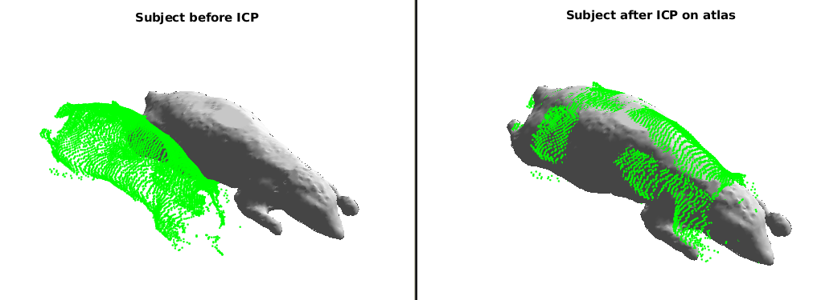
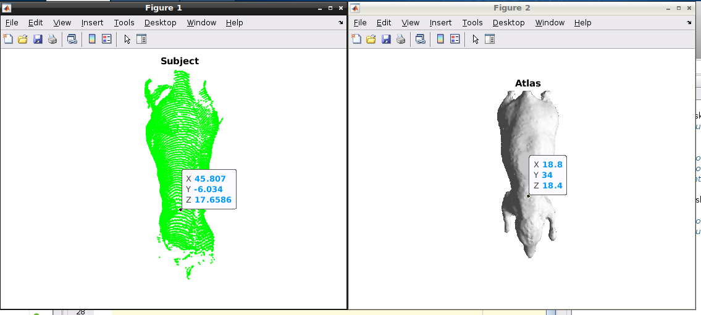

 README
 ---------- 
 
This is implementation of our paper on DigiWarp referenced below. It implements a method for fitting a deformable mouse atlas to surface topographic range data acquired by an optical system. As an initialization procedure, we match the posture of the atlas to the posture of the mouse being imaged using landmark constraints. The asymmetric L(2) pseudo-distance between the atlas surface and the mouse surface is then minimized in order to register two data sets. A Laplacian prior is used to ensure smoothness of the surface warping field. Once the atlas surface is normalized to match the range data, the internal anatomy is transformed using elastic energy minimization.

-----------
The software is implemented in Matlab and is presented as is, without any explicit or implicit warranties. Please email Anand A Joshi <ajoshi@usc.edu> if you have any questions or need support.

* Start by downloading Digimouse atlas: [Download Digimouse Atlas](https://neuroimage.usc.edu/neuro/Digimouse) and unzip it in a folder.

* There are 3 main scripts.
`main_select_points_for_reorientation.m`, `main_ICP_reposition.m` and `main_digiwarp.m`. The two scripts `main_ICP_reposition.m` and `main_digiwarp.m` repositions the pointset or the atlas so that they are approximately aligned, or reoriented. The `main_digiwarp.m` script does the actual warping.

* Start with `main_ICP_reposition.m`. Please read comments in the main script. It will realign subject point cloud to match the atlas. If you have imaging data corresponding to the subject point cloud, you have to figure out a way to keep them in alignment. You can use the utilities in `src` folder.

The screenshot below shows the result of ICP.

-----------

* If the previous script does not work and the atlas and subject pointsets are not in alignment after running the script, you can try `main_select_points_for_reorientation.m`.

Please read comments in the matlab script. You can use this script to select a set of initial points on the subject and atlas to get an approximate alignment.
Here is a screenshot of point selection process:

For points selection process, please check our paper above. 

* Then run `main_digiwarp.m` script. Make sure that all the variables in this script are properly initialized to the desired values.
This script will run for some time (~30 min) and generate the outputs in the output directory that you configured in the main script. The output will be warped volume and warped tetrahedral mesh saved in ANALYZE (img/hdr) and .mat format respectively.

Please cite our papers below if you find this software useful.

# References

Joshi AA, Chaudhari AJ, Li C, Dutta J, Cherry SR, Shattuck DW, Toga AW and Leahy RM, **DigiWarp: a method for deformable mouse atlas warping to surface topographic data**, *Physics in Medicine and Biology*, 55(20), 6197-6214.[link](http://dx.doi.org/10.1088/0031-9155/55/20/011)

Joshi AA, Chaudhari AJ, Li C, Shattuck DW, Dutta J, Leahy RM, Toga AW, **Posture Matching and Elastic Registration of a Mouse Atlas to Surface Topography Range Data**, *Proc. ISBI 2009*: 366-369. [link](https://doi.org/10.1109/ISBI.2009.5193060)

